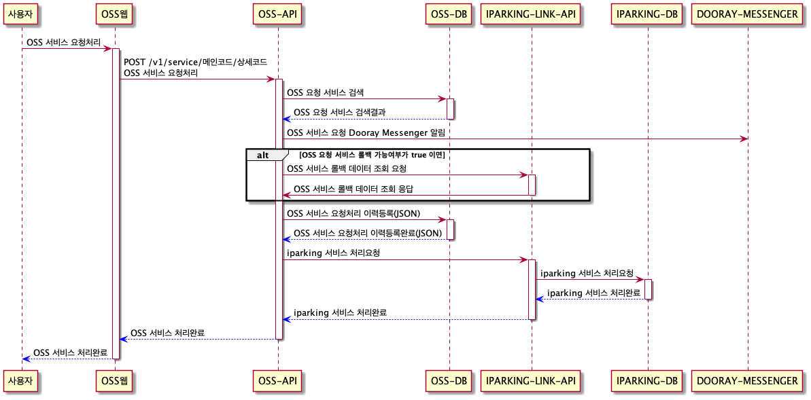
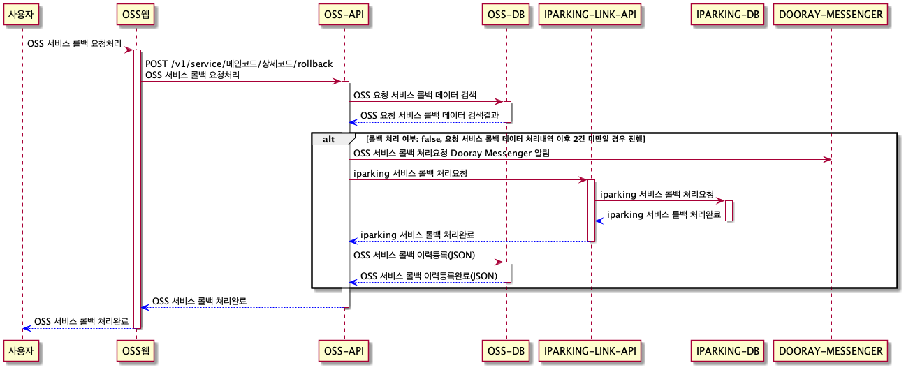
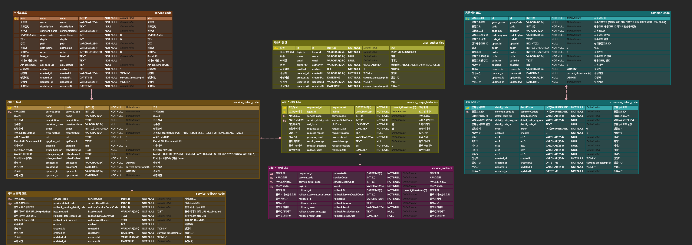

# OSS 개발 가이드

## OSS 개발 순서
1. OSS 서비스 개발 요청자에게 SQL과 구체적인 기능 요청서를 받음
2. 기능요청서를 검토하고 궁금한 부분을 문의
3. 기능요청서 분석이 끝나면 본격적인 기획 및 화면설계 후 이채은 매니저에게 화면 개발요청 화면설계는 https://ovenapp.io/ 이용
4. 먼저 [`iparking-link-api`](http://gitlab.parkingcloud.co.kr/backoffice/server/oss/iparking-link-api) 에 요청 서비스를 개발 및 테스트
5. [`iparking-link-api`](http://gitlab.parkingcloud.co.kr/backoffice/server/oss/iparking-link-api) 에 추가된 요청 서비스를 OSS-API Swagger을 통해 OSS에 서비스 메인, 서비스 상세 데이터를 등록
6. 롤백 처리가 필요하다면 추가로 [`iparking-link-api`](http://gitlab.parkingcloud.co.kr/backoffice/server/oss/iparking-link-api)에 롤백 데이터 조회 및 롤백 처리 API 개발후 OSS 서비스 롤백 데이터를 등록
7. 프론트 개발자에게 등록된 서비스 명을 알려주고 OSS-API Swagger에서 
    [등록된 서비스를 조회](http://localhost:9001/swagger-ui/index.html#/OSS%20%EC%84%9C%EB%B9%84%EC%8A%A4/getServiceInfoUsingGET)하여 개발하도록 안내해주면 됨


---


## OSS 서비스 요청처리 FLOW




---


## OSS 서비스 롤백 요청처리 FLOW




---


## OSS ERD
https://www.erdcloud.com/d/b6vdewbCohDAF2vJF



---


## OSS Swagger API Docs
### local
- oss-api: http://localhost:9001/swagger-ui/index.html
- iparking-link-api: http://localhost:9002/swagger-ui.html


---


## OSS-API application 설정
### 외부 서비스 설정
```yaml
## 외부 서비스 URL
external-service:
  ## Link URL 정보
  link:
    iparking:
      ## App Link URL 사용여부 (사용시 DB 데이터는 무시하고 App 프로퍼티 값을 사용)
      enabled: true
      ## 내부통신용 OSS Link 서비스 URL Profile에 따라 변경됨
      base-url: http://localhost:9002
      ## Swagger에서 조회되는 OSS Link Swagger API Docs URL Profile에 따라 변경됨
      swagger-url: http://localhost:9002
  dooray:
    bot-name: OSS
    bot-icon-image: https://cdn3.iconfinder.com/data/icons/chat-bot-emoji-filled-color/300/14157797Untitled-3-512.png
    ## 서비스 요청시 두레이 HOOK URL 메세지 전송
    transfer-hook-url: https://hook.dooray.com/services/2256444361245483660/2828287363472159636/f7RuQoMZRwir5hcP_h44TA
```


### 기타 속성 설정
- `domain-url`: 프론트 개발자가 접근하는 OSS 도메인 URL
  DB에는 내부 IP로 등록되어있지만 프론트 개발자가 접근하는 OSS 서비스 요청 URL은 OSS 도메인 URL로 변환하여 보여준다
- `replace-url`: 
  요청 서비스 URL 에 `UriComponentsBuilder` 로 `QueryParams` 를 생성하면 인코딩 문제로 URL이 깨지는 경우가 있음
이에 대한 조치 사항으로 `replace-url` 에 `QueryParams` 를 생성한다음 `replace-url`을 다시 요청 서비스 URL 로 변환처리 하기위한설정
```yaml
## 기타 속성설정
properties:
  ...
  service:
    ## Swagger에서 조회되는 OSS 서비스 제공 URL Profile에 따라 변경됨
    domain-url: http://localhost:9001
    ## QueryParams Encoding 변환 문제로 변환처리 할 임시 URL
    replace-url: http://replace
```


---


## OSS 서비스 등록
- OSS는 개발된 외부 API를 서비스 메인과 서비스 상세 데이터에 OSS 서비스로 등록해서 사용한다 
- 등록된 OSS 서비스는 OSS 서비스 요청 처리 API를 통해 서비스를 요청 처리 한다
    - http://localhost:9001/swagger-ui/index.html#/OSS%20%EC%84%9C%EB%B9%84%EC%8A%A4/callServiceUsingPOST
    - OSS 서비스 요청 처리 시 조회를 제외한 처리는 `처리할 데이터(request_data)`, `(변경전 데이터)old_data` 데이터를 보내 OSS 사용 이력을 등록한다 **(자세한 사용법은 Swagger API Docs 참조)**
- 프론트 개발자에게는 등록한 OSS 서비스에 대해 안내해주고 해당 OSS 서비스 상세 정보는 OSS 서비스 조회로 확인할 수 있다
    - http://localhost:9001/swagger-ui/index.html#/OSS%20%EC%84%9C%EB%B9%84%EC%8A%A4/getServiceInfoUsingGET
    - 조회된 OSS 서비스 상세 정보를 바탕으로 프론트 개발을 진행하면 된다 (자세한 사항은 Swagger API Docs 참조)

**편의를 위한 OSS 서비스 등록 화면 개발 예정**


### OSS 서비스 메인 등록
http://localhost:9001/swagger-ui/index.html#/OSS%20%EC%84%9C%EB%B9%84%EC%8A%A4%20%EB%A9%94%EC%9D%B8/serviceMainRegistrationUsingPOST

먼저 OSS 서비스 메인 데이터를 등록 해야함
OSS 서비스 메인 데이터 등록은 UI가 없으므로 현재 Swagger를 이용함

-  <span style="color:#e11d21">**(필수)**</span>`name`: 코드명
- `description`: 코드설명
- `constant_name`: 상수명
- `upper_code`: 상위 서비스 코드 **(default: 0)**
- `depth`: 뎁스 **(자동등록처리)**
- `path`: 서비스 경로 **(자동등록처리)**
- `path_name`: 서비스 경로명 **(자동등록처리)**
- `order`: 정렬순서 **(default: 0)**
- <span style="color:#e11d21">**(필수)**</span>`base_url`: Base URL **(기본 `iparking-link-api` 서비스처리 도메인)**
    -  이부분은 `application.yml`의 `external-service.link.iparking.base-url`을 우선적으로 사용하도록 설정되어있음
    -  `external-service.link.iparking.enabled` 값을 `false` 로 설정하면 DB의 `base_url` 데이터를 참조함
- `url`: 서비스 메인 URL **(Context PATH URL)**
- `api_docs_url`: Swagger API Docs URL **(해당 `iparking-link-api`서비스의 Swagger API Docs URL)**
- `enabled`: 사용여부 **(default: true)**


#### **Sample 데이터**
아래의 Sample 데이터는 **멤버스** 서비스 하위서비스 등록을 위해 **멤버스** 서비스 코드를 `upper_code` 에 입력하여 등록함
하위 서비스가 아니라면 `upper_code`를 입력하지 않음
```json
{
  "name": "멤버스 주차장/스토어 정책",
  "description": "멤버스 주차장/스토어 정책 설정",
  "constant_name": "MEMBERS_POLICY",
  "upper_code": 4,
  "base_url": "http://localhost:9002",
  "api_docs_url": "/swagger-ui.html#/members-policy-controller"
}
```


### OSS 서비스 상세 등록
http://localhost:9001/swagger-ui/index.html#/OSS%20%EC%84%9C%EB%B9%84%EC%8A%A4%20%EC%83%81%EC%84%B8/ServiceDetailRegistrationUsingPOST

OSS 서비스 메인 하위의 서비스 상세 데이터 등록
OSS 서비스 상세 데이터 등록은 UI가 없으므로 현재 Swagger를 이용함

- <span style="color:#e11d21">**(필수)**</span>`service_code`: 서비스 코드 **(서비스 메인 코드)**
- <span style="color:#e11d21">**(필수)**</span>`name`: 코드명
- `description`: 코드설명
- `constant_name`: 상수명 
- `order`: 정렬순서 **(default: 0)**
- <span style="color:#e11d21">**(필수)**</span>`http_method`: 서비스 HttpMethod **(POST, PUT,  PETCH, DELETE, GET, OPTIONS, HEAD, TRACE)**
- <span style="color:#e11d21">**(필수)**</span>`url`: 서비스 상세 URL (**PathVariable**까지 포함해서 **서비스 메인 `base_url` 이후의 API URL 이후의 상세한 서비스 URL을 등록**)
- `api_docs_url`: Detail Swagger API Docs URL **(서비스 메인에 등록된 `api_docs_url` 이후의 URL을 입력)**
- `enabled`: 사용여부 **(default: true)**
- `other_base_url`: 타서비스 기본 URL **(타 서비스 사용시 타 서비스 도메인 URL)**
- `other_main_url`: 타서비스 메인 URL  **(타 서비스 사용시 타 서비스 Context PATH URL)**
- `other_enabled`: 타서비스 사용여부 **(default: false)**


#### **Sample 데이터**
`service_code` 상위의 서비스코드 입력은 필수 그외 서비스 상세 iparking-link-api 정보를 등록한다 
```json
{
  "service_code": 7,
  "name": "멤버스 주차장 정책 설정 등록",
  "description": "멤버스 주차장 정책 설정 등록",
  "constant_name": "POST_V1_MEMBERS_PARKING_POLICY",
  "http_method": "POST",
  "url": "/v1/members/parking/policy",
  "api_docs_url": "/getMembersParkingPolicyUsingPOST"
}
```


### OSS 서비스 롤백 등록
http://localhost:9001/swagger-ui/index.html#/OSS%20%EC%84%9C%EB%B9%84%EC%8A%A4%20%EB%A1%A4%EB%B0%B1/serviceRollbackRegistrationUsingPOST

OSS 등록 서비스에 대해 OSS 서비스 롤백 데이터를 등록 해주어야 롤백 처리가 가능하다

OSS 서비스 상세 하위의 서비스 롤백 등록
서비스 상세 하위의 서비스 롤백 데이터 등록

- <span style="color:#e11d21">**(필수)**</span>`service_code`: 서비스 메인 코드
- <span style="color:#e11d21">**(필수)**</span>`service_detail_code`: 서비스 상세 코드
- <span style="color:#e11d21">**(필수)**</span>`http_method`: 롤백 데이터 조회 URL HTTP METHOD **(default: GET)**
- <span style="color:#e11d21">**(필수)**</span>`rollback_service_detail_code`: 롤백 서비스 상세 코드 **(롤백 처리 API 정보를 등록한 서비스 상세 코드 입력)**
- <span style="color:#e11d21">**(필수)**</span>`rollback_data_search_url`: 롤백 데이터 조회 URL **(서비스 메인 `base_url` 이후의 API URL을 입력)**
- `rollback_api_docs_url`: 롤백 Swagger API Docs URL **(서비스 메인에 등록된 `api_docs_url` 이후의 URL을 입력)**
- `enabled`: 사용여부 **(default: true)**

```json
{
  "http_method": "GET",
  "rollback_api_docs_url": "/getStoreDiscountRollbackUsingGET",
  "rollback_data_search_url": "/v1/members/discount/parkinglot/{park_seq}/store/rollback",
  "rollback_service_detail_code": 10
}
```


---


## OSS 서비스 조회
http://localhost:9001/swagger-ui/index.html#/OSS%20%EC%84%9C%EB%B9%84%EC%8A%A4/getServiceInfoUsingGET

Swagger의 **OSS 등록된 서비스 조회**에서 OSS에 등록한 서비스를 확인할 수 있음

**프론트 개발자**에게 **OSS-API** Swagger 에서 등록된 서비스를 조회하여서 개발하면 된다고 알려주면 됨

아래의 항목 중 프론트 개발자는 프론트 개발을 위해서 `service_url`로 API를 호출하면 되고
상세 Swagger API Docs 는 `service_detail_api_docs_url`을 참조하면된다


### 서비스 주요 정보 (프론트 개발자는 이 데이터만 참조하면 됨)
- `service_category`: 서비스 카테고리 상위 서비스가 있다면 연계된 카테고리 정보를 모두 보여줌
- `service_main_name`: 서비스 메인 명 **(서비스 현재 카테고리)**
- `service_detail_name`: 서비스 상세 기능 명
- `service_url`: OSS 서비스 요청처리 URL **(프론트 개발시 요청할 URL)**
- `service_main_api_docs_url`: 해당 서비스의 Swagger Api Docs URL **(해당 `iparking-link-api` 서비스의 Swagger API Docs URL)**
- `service_detail_api_docs_url`: 서비스 상세 기능에 대한 Swagger API Docs URL **(해당 `iparking-link-api` 상세 서비스의 Swagger API Docs URL)**
- `service_link_url`: 연계 서비스 URL **(해당 `iparking-link-api` 상세 서비스의 REST API URL)**
- `rollback_possible`: 롤백 가능 여부 **(true: 롤백 가능, false: 롤백 불가능)**


### 서비스 전체 정보
- `service_main_info`: 서비스 메인 정보
- `service_detail_info`: 서비스 상세 정보
- `service_rollback_info`: 서비스 롤백 정보
- `rollback_service_detail_info`: 서비스 롤백 처리 상세 정보


#### **Sample 데이터**
주차장 정보조회 OSS 서비스 조회 데이터
```json
{
  "code": 100,
  "msg": "SUCCESS",
  "result": [
    {
      "service_category": "멤버스|멤버스 할인 정책|멤버스 스토어 정책",
      "service_main_name": "멤버스 스토어 정책",
      "service_detail_name": "멤버스 스토어 정책 등록",
      "service_url": "http://localhost:9001/v1/service/8/4",
      "service_main_api_docs_url": "http://localhost:9002/swagger-ui.html#/멤버스%20할인%20정책%20설정%7C멤버스%20스토어%20정책",
      "service_detail_api_docs_url": "http://localhost:9002/swagger-ui.html#/멤버스%20할인%20정책%20설정%7C멤버스%20스토어%20정책/registStorePolicyUsingPOST",
      "service_link_url": "http://localhost:9002/v1/members/discount/policy/parkinglot/{park_seq}/store",
      "rollback_possible": true,
      "service_main_info": {
        "code": 8,
        "name": "멤버스 스토어 정책",
        "description": "멤버스 스토어 정책",
        "constant_name": "MEMBERS_DISCOUNT_POLICY_STORE",
        "upper_code": 7,
        "depth": 2,
        "path": "4|7|8",
        "path_name": "멤버스|멤버스 할인 정책|멤버스 스토어 정책",
        "base_url": "http://localhost:9002",
        "url": "",
        "api_docs_url": "/swagger-ui.html#/멤버스%20할인%20정책%20설정%7C멤버스%20스토어%20정책",
        "enabled": true
      },
      "service_detail_info": {
        "service_code": 8,
        "code": 4,
        "name": "멤버스 스토어 정책 등록",
        "description": "멤버스 스토어 정책 등록",
        "constant_name": "POST_V1_MEMBERS_DISCOUNT_POLICY_STORE",
        "http_method": "POST",
        "url": "/v1/members/discount/policy/parkinglot/{park_seq}/store",
        "api_docs_url": "/registStorePolicyUsingPOST",
        "enabled": true,
        "other_enabled": false
      },
      "service_rollback_info": {
        "service_code": 8,
        "service_detail_code": 4,
        "rollback_service_detail_code": 7,
        "http_method": "GET",
        "rollback_data_search_url": "/v1/members/discount/policy/parkinglot/{park_seq}/store/rollback",
        "rollback_api_docs_url": "/getStorePolicyRollbackUsingGET",
        "enabled": true
      },
      "rollback_service_detail_info": {
        "service_code": 8,
        "code": 7,
        "name": "멤버스 스토어 정책 롤백",
        "description": "멤버스 스토어 정책 롤백",
        "constant_name": "POST_V1_MEMBERS_STORE_POLICY_ROLLBACK",
        "http_method": "POST",
        "url": "/v1/members/discount/policy/parkinglot/store/rollback",
        "api_docs_url": "/applyStorePolicyRollbackUsingPOST",
        "enabled": true,
        "other_enabled": false
      }
    }
  ]
}
```


---


## OSS 서비스 처리
http://localhost:9001/swagger-ui/index.html#/OSS%20%EC%84%9C%EB%B9%84%EC%8A%A4/callServiceUsingPOST

Swagger의 **OSS 등록된 서비스 조회**에서 OSS에 등록한 서비스를 확인할 수 있음

프론트 개발자가 OSS 서비스를 처리하기위해서는 **OSS-API**의 **OSS 서비스 요청처리(`/v1/service/{service_main_code}/{service_detail_code}`)** API를 호출하면된다 

아래의 항목 중 프론트 개발자는 프론트 개발을 위해서 `service_url`로 API를 호출하면 되고
상세 **Swagger API Docs** 는 `service_detail_api_docs_url`을 참조하면된다


### 서비스 요청 기능 설명
- **OSS** 서비스 요청처리 URL 기본구조는 **서비스 메인코드**와 **서비스 상세코드**를 **PathVariable** 로 받아서 처리한다
- **OSS** 서비스로 등록된 서비스 정보는 [**OSS 등록된 서비스 조회**] 를 통해 확인할 수 있다
- **OSS** 서비스 요청처리는 **POST** 요청으로 받으며 요청 객체는**JSON**으로 받는다
- **OSS** 서비스 요청처리는 요청을 받아서 **IPARKING** 연계 서비스(**iparking-link-api**)와 통신하여 처리할 때 모든 요청(`POST`,`GET`,`PATCH`,`PUT`,`DELETE`)에 대하여 등록된 **HttpMethod**에 따라 **OSS-API**에서 자동 분기처리 하고 이력을 남긴다


### 서비스 요청 PathVariable
- **서비스 메인코드(`service_main_code`):** 서비스 카테고리 그룹
- **서비스 상세코드(`service_detail_code`):** 서비스 상세기능 코드
- 요청 URL 예시) http://localhost:9001/v1/service/1/1


### 서비스 요청 객체
각 서비스별 요청객체 작성은 [**OSS 등록된 서비스 조회**] 에서 조회된 각 서비스별 Api Docs URL을 참조
- `old_data` - 수정처리 시 반드시 변경전 데이터를 `old_data` 필드에 담아서 보낸다
  삭제나 등록시에는 비워서 보낸다
- `request_data` - 해당 서비스를 통해 처리할 데이터를 담아서 보낸다
- `request_reason` - 요청 사유 입력


#### **Sample 데이터**
아래는 아이디 변경 요청 JSON 데이터 예시
```json
{
  "loginId": "msgwon",
  "old_data": {
    "seq": "91278",
    "id": "PACLc3d8f62d57a74a2b8f038ad65d071cc4"
  },
  "request_data": {
    "new_id": "testid",
    "seq": "91278",
    "id": "PACLc3d8f62d57a74a2b8f038ad65d071cc4"
  },
  "request_reason": "요청사유"
}
```


---


## OSS 서비스 처리 내역
- **화면 경로:** OSS 관리 - 서비스 처리 내역

관리자로 등록된 사용자만 사용할 수 있으며
OSS 서비스 처리 내역을 조회할 수 있고 상세 항목별로 최근 2개의 데이터에 대해 롤백 처리 할 수 있다


---


## OSS 사용자 관리
- **화면 경로:** OSS 관리 - 사용자 관리
**IMIS에 등록된 아이디**를 검색하여 **관리자 아이디를 등록**할 수 있으며
관리자 아이디로 등록된 사용자만 **OSS 관리** 카테고리에 있는 기능들을 사용할 수 있다