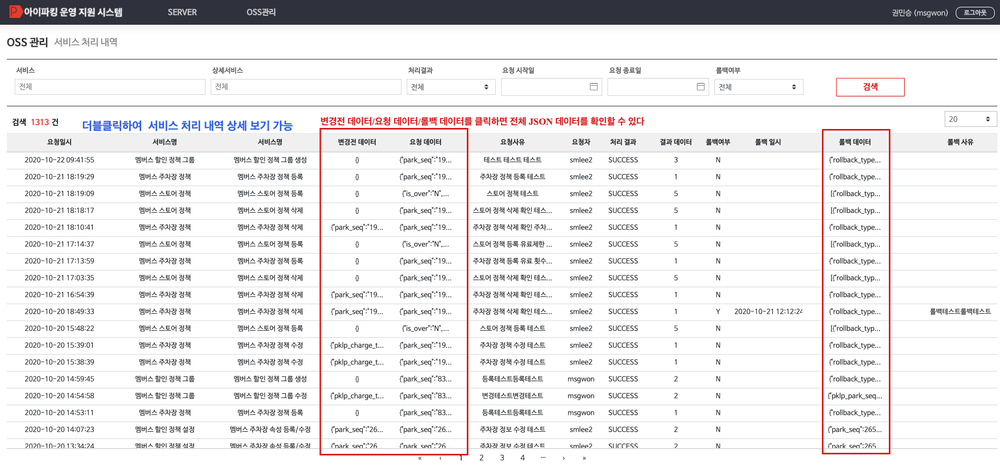

# 서비스 처리 내역 가이드
**서비스 처리 내역**, **서비스 롤백 처리 내역**을 조회하고 **롤백** 처리 할 수 있는 기능
**OSS 관리자**로 등록된 사용자만 사용할 수 있다

- **변경전 데이터/요청 데이터/롤백 데이터**를 클릭하여 **전체 JSON 데이터**를 확인할 수 있다
- **더블클릭**시 **서비스 처리 내역 상세 보기** 화면이 팝업된다
- **서비스 롤백 코드**에 롤백 정보가 등록되어 있고 **롤백 데이터**가 생성된 서비스 처리 내역은 **롤백 처리**를 수행할 수 있다




---


## 1) 데이터 상세보기
- **변경전 데이터/요청 데이터/롤백 데이터**를 클릭하여 **전체 JSON 데이터**를 확인할 수 있다
- 팝업된 화면 밖을 클릭하면 상세보기 화면을 닫을 수 있다


---


## 2) 더블클릭 시 서비스 처리 내역 상세 보기


### 1. 서비스 처리 내역 상세 보기 롤백가능
서비스 처리 내역 상세 보기 호출시  **롤백 가능 여부**가 `true` 이고 롤백 데이터가 있는 경우 
롤백 처리를 할 수 있는 **ROLLBACK** 버튼이 **<span style="color:#207de5">활성화</span>** 된다


### 2. 서비스 처리 내역 상세보기 롤백완료
롤백이 완료된 내역의 경우에는 **서비스 처리 내역**과 **서비스 롤백 내역**을 모두 확인할 수 있다
롤백 처리가 완료된 경우에는 **ROLLBACK** 버튼이 **<span style="color:#e11d21">비활성화</span>** 된다


### 3. 서비스 처리 내역 상세보기 데이터 상세보기
서비스 처리 내역 상세보기 화면에서 `+` 버튼을 클릭하면 펼쳐지면서 **전체 JSON 데이터**를 확인할 수 있다
다시 `-` 버튼을 클릭하면 펼쳐진 부분을 닫는다


### ```서비스 롤백 불가능 알림```
**최근 처리 내역 건수**가 **3건** 이상이면 **ROLLBACK** 버튼이 **<span style="color:#e11d21">비활성화</span>** 되며 아래와 같은 알림창이 팝업된다
최근 처리 내역 **3건**이 모두 롤백 처리 된다면 그 다음 **3건**에 대한 롤백이 가능해진다

