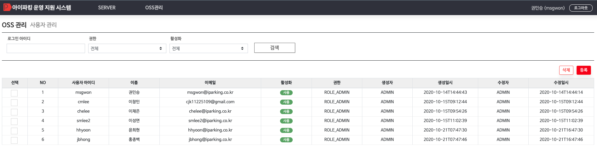

# 사용자 관리 가이드
**OSS 관리자**를 등록할 수 있는 기능




---


## 1) 사용자 등록
**로그인 아이디**를 입력하고 **적용** 버튼을 클릭하면 **IMIS 회원정보**를 조회하여**OSS 관리자**로 등록한다


### ```조회된 회원정보가 없을 경우```
**조회된 회원정보가 없을 경우** 아래와 같은 알림이 팝업되고 등록되지 않는다


## 2) 사용자 삭제
삭제할 사용자의 **좌측 체크박스를 선택**하고 **삭제** 버튼을 클릭해 사용자를 삭제한다

