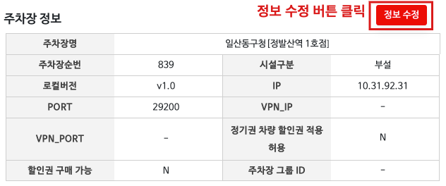

# 할인 정책 설정 사용 가이드
할인 정책 설정은 **주차장**이나 **스토어** 별로 **시간(분), 금액, 비율, 횟수** 제한을 설정할 수 있는 기능이다


---


## 1) 할인 정책 설정 레이아웃


### 1. 검색 영역
**<span style="color:#e11d21">(필수)</span>** 주차장 , 스토어 검색 입력값으로 해당되는 할인 정책 설정을 조회할 수 있음


### 2. 스토어 정책 리스트 영역
- 설정된 스토어 정책 리스트를 보여준다
- 수정하고 싶은 스토어 정책을 **더블클릭** 하여 스토어 정책을 **수정**할 수 있다
- 좌측 **체크박스**를 선택하고 상단 **<span style="color:#e11d21">스토어 정책 삭제</span>** 버튼을 클릭해 스토어 정책을 **삭제**할 수 있다
- 할인 정책 그룹에 속한 스토어 정책은 **수정/삭제**가 **<span style="color:#e11d21">불가능</span>** 하다


### 3. 주차장 정보 영역
검색한 주차장에 대한 정보를 확인할 수 있고 **정기권 차량 할인권 적용 허용 여부**와 **할인권 구매 가능 여부**를 설정할 수 있다


### 4. 주차장 정책 영역
주차장 정책을 등록/수정/삭제 처리 할 수 있다


### 5. 할인 정책 그룹 영역
할인 정책 그룹을 등록/수정/삭제 처리 할 수 있다
할인 정책 그룹이란 그룹에 묶은 스토어들에 대해 통합으로 제한 설정을 부여할 수 있는 기능이다
그룹 별 통합 제한 설정이 필요한 경우 활용하면 좋다
- 내용참조: https://parkingcloud.dooray.com/project/2539663239114251904?contentsType=wiki&pageId=2543638503907191735


---


## 2) 주차장 정보
검색한 주차장에 대한 정보를 확인할 수 있고 **정기권 차량 할인권 적용 허용 여부**와 **할인권 구매 가능 여부**를 설정할 수 있다
주차장 정보 우측 상단 **정보 수정** 버튼을 클릭하면 주차장 정보 수정 화면이 팝업된다




### 주차장 정보 수정
- **정기권 차량 할인권 적용 허용 여부** - **<span style="color:#207de5">Y</span>:** 정기권 차량 할인권 적용 허용, **<span style="color:#207de5">N</span>:** 정기권 차량 할인권 적용 미허용
    - 정기권 차량의 경우 멤버스 할인권 적용이 처리 되지 않아 옵션으로 **허용/미허용** 처리를 할 수 있도록 설정
- **할인권 구매 가능 여부** -  **<span style="color:#207de5">Y</span>:** 구매가능, **<span style="color:#207de5">N</span>:** 구매불가능
    - 멤버스 할인권 구매가능 여부 설정


---


## 3) 스토어 정책 설정


### 1. 스토어 정책 등록
스토어 정책 리스트 상단 **스토어 정책 등록** 버튼을 클릭하면 **스토어 정책 등록** 화면이 팝업된다
**스토어 정책 등록** 화면에서 스토어 정책 등록을 진행하면 된다

1. 등록할 스토어를 선택
2. 스토어 정책을 설정
3. 설정 완료 후 적용


### 2. 스토어 정책 수정

스토어 정책 리스트에서 수정할 스토어 정책을 **더블클릭** 하면 스토어 정책 수정 화면이 팝업된다
스토어 정책을 수정하고 **적용** 버튼을 클릭하면 수정사항이 반영된다


### 3. 스토어 정책 삭제
1. 스토어 정책 리스트에서 삭제하고 싶은 스토어 정책 **체크박스** 선택
2. 스토어 정책 리스트 상단 **스토어 정책 삭제** 버튼 클릭
3. **스토어 정책 삭제 확인** 팝업 화면에서 **삭제사유** 입력
4. 삭제 버튼 클릭


### ```스토어 정책 등록/수정 유효성 검증```


##### [등록할 정책과 동일한 정책이 이미 존재하는 경우]
  우측 상단에 **'모든 설정값이 동일한 정책이 이미 존재합니다'** 문구의 알림창이 팝업되고 등록이 되지 않음
  


##### [등록할 정책의 일부 데이터가 다른 정책이 이미 존재하는 경우]
- **스토어 정책 등록 중복 확인** 화면이 팝업됨
- **중복 정책**을 **<span style="color:#e11d21">변경 예정 정책</span>** 으로 덮어씌움


##### [수정할 정책의 일부 데이터가 다른 정책이 이미 존재하는 경우]
- **스토어 정책 수정 중복 확인** 화면이 팝업됨
- **중복 정책**의 **<span style="color:#e11d21">변경된 설정값</span>** 을 반영함


##### [징수유형:유/무료 정책이 각각 있는 경우 징수유형:전체 정책 등록/수정 불가]
동일한 **제한유형, 차종유형** 정책에 **징수유형:전체**정책은 유/무료 통합된 설정이기 떄문에 1개만 등록가능 하므로
**징수유형:전체** 정책과 동시에 등록되지 못하도록 유효성을 검증하여 등록/수정을 금지시킴


---


## 4) 주차장 정책 설정


### 1. 주차장 정책 등록

- 주차장 정책 우측 상단 `+` 버튼을 클릭하면 주차장 정책 등록 화면이 팝업됨
- 등록할 주차장 정책을 설정 후 **적용** 버튼 클릭


### 2. 주차장 정책 수정

- 수정할 주차장 정책을 **더블클릭**하면 주차장 정책 수정 화면이 팝업됨
- 주차장 정책 설정 수정 후 **적용** 버튼 클릭


### 3. 주차장 정책 삭제

- 주차장 정책 리스트에서 삭제 항목의 `-` 버튼을 클릭하여 주차장 정책을 삭제
- **주차장 정책 삭제 확인** 팝업 화면에서 **삭제사유**를 입력하고 **삭제** 버튼 클릭


### ```주차장 정책 등록/수정 유효성 검증```


##### [등록할 정책과 동일한 정책이 이미 존재하는 경우]
  우측 상단에 **'모든 설정값이 동일한 정책이 이미 존재합니다'** 문구의 알림창이 팝업되고 등록이 되지 않음
  


##### [등록할 정책의 일부 데이터가 다른 정책이 이미 존재하는 경우]
- **주차장 정책 등록 중복 확인** 화면이 팝업됨
- **중복 정책**의 **<span style="color:#e11d21">변경된 설정값</span>** 을 반영함


##### [수정할 정책의 일부 데이터가 다른 정책이 이미 존재하는 경우]
- **주차장 정책 수정 중복 확인** 화면이 팝업됨
- **중복 정책**의 **<span style="color:#e11d21">변경된 설정값</span>** 을 반영함


##### [징수유형:유/무료 정책이 각각 있는 경우 징수유형:전체 정책 등록/수정 불가]
동일한 **제한유형, 차종유형** 정책에 **징수유형:전체**정책은 유/무료 통합된 설정이기 떄문에 1개만 등록가능 하므로
**징수유형:전체** 정책과 동시에 등록되지 못하도록 유효성을 검증하여 등록/수정을 금지시킴


---


## 5) 할인 정책 그룹


### 1. 할인 정책 그룹 생성

- 할인 정책 그룹 우측 상단 `+` 버튼을 클릭하면 할인 정책 그룹 생성 화면이 팝업됨
- 할인 정책 그룹에 포함할 스토어를 선택
- 생성할 할인 정책 그룹을 설정 후 **적용** 버튼 클릭


##### [생성할 할인 정책 그룹과 동일한 할인 정책 그룹이 이미 존재하는 경우]
  우측 상단에 **'모든 설정값이 동일한 정책이 이미 존재합니다'** 문구의 알림창이 팝업되고 생성이 되지 않음
  


##### [생성할 할인 정책 그룹의 일부 데이터가 다른 할인 정책 그룹이 이미 존재하는 경우]
- **할인 정책 그룹 생성 중복 확인** 화면이 팝업됨
-  기존 중복 할인 정책 그룹 데이터를 현재 입력된 설정 값으로 **변경** 처리함


### 2. 할인 정책 그룹 수정

- 수정할 할인 정책 그룹을 **더블클릭**하면 할인 정책 그룹 수정 화면이 팝업됨
- 할인 정책 그룹에 포함할 스토어를 선택
- 할인 정책 그룹 설정 수정 후 **적용** 버튼 클릭


### 3. 할인 정책 그룹 삭제

- 할인 그룹 정책 리스트에서 삭제 항목의 `-` 버튼을 클릭하여 할인 정책 그룹을 삭제
- **할인 정책 그룹 삭제 확인** 팝업 화면에서 **삭제사유**를 입력하고 **삭제** 버튼 클릭


### ```할인 정책 그룹 생성/수정 유효성 검증```


##### [등록할 할인 정책 그룹 과 동일한 할인 정책 그룹이 이미 존재하는 경우]
  우측 상단에 **'모든 설정값이 동일한 정책이 이미 존재합니다'** 문구의 알림창이 팝업되고 등록이 되지 않음
  


##### [연결된 스토어가 같고 등록할 할인 정책 그룹의 일부 데이터가 다른 할인 정책 그룹이 이미 존재하는 경우]
- **할인 정책 그룹 생성 중복 확인** 화면이 팝업됨
- **중복 할인 정책 그룹**의 **<span style="color:#e11d21">변경된 설정값</span>** 을 반영함


##### [연결된 스토어가 같고 수정할 할인 정책 그룹의 일부 데이터가 다른 할인 정책 그룹이 이미 존재하는 경우]
- **주차장 정책 수정 중복 확인** 화면이 팝업됨
- **중복 할인 정책 그룹**의 **<span style="color:#e11d21">변경된 설정값</span>** 을 반영함


##### [징수유형:유/무료 정책이 각각 있는 경우 징수유형:전체 정책 생성/수정 불가]
동일한 **제한유형, 차종유형** 정책에 **징수유형:전체**정책은 유/무료 통합된 설정이기 떄문에 1개만 등록가능 하므로
**징수유형:전체** 정책과 동시에 등록되지 못하도록 유효성을 검증하여 생성/수정을 금지시킴


---


## 설정 예시
- **예시1) 주차장 정책 횟수 제한 예시**
  특정 주차장에 포함된 모든 스토어에서 차종유형 A, 무료 할인권을 10회만 사용가능하게 설정
    - 주차장 정책에 **징수유형:<span style="color:#207de5">무료</span>, 제한유형:<span style="color:#207de5">횟수</span>, 제한값:<span style="color:#207de5">10</span>, 차종유형:<span style="color:#207de5">A</span>** 로 설정
- **예시2) 스토어 정책 시간(분) 제한 예시**
  특정 스토어에 차종유형 A, 유료 할인권 24시간 시간 제한을 설정하고 싶은데 1시간 또는 2시간을 사용했어도 24시간 사용권을 사용이 가능하도록 설정
    - 특정 스토어 정책으로 **징수유형:<span style="color:#207de5">유료</span>, 제한유형:<span style="color:#207de5">시간</span>, 제한값:<span style="color:#207de5">1440</span>, 차종유형:<span style="color:#207de5">A</span>**, **초과값 허용여부:<span style="color:#207de5">Y</span>** 로 설정
    - 초과값 허용여부의 경우 초과된 시간 할인권을 사용할 수 있게 해준다
- **예시3) 복잡한 할인 정책 그룹 제한 예시**
  1그룹에 2시간, 2그룹에 3시간, 1,2그룹에 포함된 스토어들은 3시간으로 설정 하고 싶다면
  - 1그룹 설정 - 할인 정책 1그룹을 생성하고 설정할 스토어들에 대해서 2시간 설정한 데이터를 추가한다
  - 2그룹 설정 - 할인 정책 2그룹을 생성하고 설정할 스토어들에 대해서 3시간 설정한 데이터를 추가한다
  - 3그룹 설정 - 할인 정책 3그룹을 생성하고 1,2그룹에 설정한 스토어들에 대해서 3시간 설정한 데이터를 추가한다
