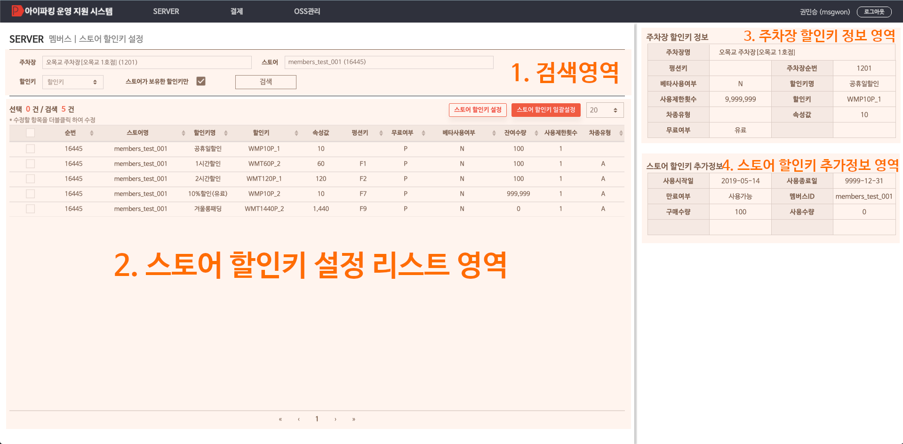

# 스토어 할인키 설정 가이드
스토어 할인키의 **사용제한횟수**와 **베타사용여부**를 설정할 수 있는 기능


---


## 1) 스토어 할인키 설정 레이아웃



### 1. 검색 영역
<span style="color:#e11d21">**(필수)**</span> 주차장, 스토어, 할인키, 스토어가 보유한 할인키만 검색 입력값으로 해당되는 스토어 할인키 설정을 조회할 수 있음


### 2. 스토어 할인키 설정 리스트 영역
- 설정된 스토어 할인키 설정 리스트를 보여준다
- 수정하고 싶은 스토어 할인키를 **더블클릭** 하여 스토어 할인키 설정을 **수정**할 수 있다
- 좌측 **체크박스**를 선택하고 상단 **<span style="color:#207de5">스토어 할인키 설정</span>** 버튼을 클릭해 선택된 스토어 할인키들에 대해 **일괄 설정**을 할 수 있다
- **스토어 할인키 일괄설정** 버튼을 클릭해 다음 항목에 대한 스토어 할인키 일괄설정을 진행할 수 있다
    - 주차장에 속한 모든 스토어 할인키
    - 주차장에 속한 모든 스토어의 특정 할인키
    - 특정 스토어의 모든 할인키
    - 특정 스토어의 특정 할인키


### 3. 주차장 할인키 정보 영역
- 스토어 할인키 설정 리스트에서 클릭한 할인키의 **주차장 할인키**의 다음의 정보가 표출된다
    - 주차장명
    - 주차장순번
    - 할인키
    - 할인키명
    - 펑션키
    - 베타사용여부
    - 사용제한횟수
    - 차종유형
    - 속성값
    - 무료여부


### 4. 스토어 할인키 추가정보 영역
- 스토어 할인키 설정 리스트에서 클릭한 할인키의 다음의 **추가정보**가 표출된다
    - 사용시작일
    - 사용종료일
    - 만료여부
    - 멤버스ID
    - 구매수량
    - 사용수량


---


## 2) 스토어 할인키 설정 리스트


### 스토어가 보유한 할인키만
- **스토어가 보유한 할인키만 선택시:** 스토어가 보유한 할인키 설정 리스트만 검색됨
- **스토어가 보유한 할인키만 선택해제시:** 스토어의 설정된 모든 할인키 리스트가 검색됨


---


## 2) 스토어 할인키 단건 수정 
검색된 스토어 할인키를 **더블클릭**하여 
해당 할인키에 대한 **사용제한횟수**, **베타사용여부**를 단건 수정할 수 있음


---


## 3) 스토어 할인키 선택 일괄설정 
1. 검색된 스토어 중 **일괄설정**하고 싶은 스토어 할인키의 **체크박스**를 선택
    상단 **<span style="color:#207de5">4. 스토어 할인키 설정</span>** 버튼을 클릭해서 선택된 스토어 할인키에 대해 **일괄설정**을 진행 할 수 있음
2. 스토어 할인키 설정 팝업화면에서 선택된 체크박스를 선택/해제 하여 재변경할 수 있음
3. **사용제한횟수**, **베타사용여부**를 선택하여 설정값을 입력
4. **변경사유**를 입력하고 **적용** 버튼을 클릭하여 적용


---


## 4) 스토어 할인키 일괄설정
스토어 할인키 설정시 **일괄**로 **전체/유료/무료**를 구분하여 
**사용제한횟수**, **베타사용여부**를 선택하여 설정할 수 있음

1. **일괄설정 적용범위 검색조건:** 
    - **일괄설정 적용범위**가 **스토어, 할인키**인 경우 활성화됨
    - **일괄설정 적용범위**가 **스토어**인 경우 **스토어** 검색조건을 선택할 수 있다
      - **스토어 선택** 시 **선택된 해당 스토어에 대한 설정만** 진행한다
    - **일괄설정 적용범위**가 **할인키**인 경우 **스토어,할인키** 검색조건을 선택할 수 있다
      - **할인키만 선택**시 **주차장에 속한 모든 스토어 할인키**에 대해 **선택된 할인키에 대한 설정**을 진행한다
      - **스토어, 할인키 모두 선택**시 **선택된 스토어의 선택된 할인키에 대해서만 설정**을 진행한다
2. 일괄설정이 적용될 **스토어 할인키 건수**를 검색해서 보여준다
3. **일괄설정 적용범위**
    - **주차장:** 주차장에 속한 모든 스토어 할인키
    - **스토어:** 스토어 할인키 적용범위 검색조건에서 선택한 스토어의 모든 할인키
    - **할인키:** 스토어 할인키 적용범위 검색조건에서 선택한 스토어의 선택된 할인키
4. **일괄설정 무료여부:** **전체/유료/무료** 여부 선택
5. **사용제한횟수**, **베타사용여부**를 선택 후 설정값 입력


### 스토어 할인키 일괄설정 확인
**변경사유**를 입력하고 **적용**버튼 클릭시 적용될 **스토어 할인키 일괄설정 확인** 화면이 팝업됨
**적용할 스토어 할인키 정보, 건수, 설정 값**을 **최종 확인**할 수 있음 


### 1. ```주차장에 속한 모든 스토어 할인키 일괄설정 시```
1. **일괄설정 적용범위**를 **주차장**으로 선택
2. **일괄설정 무료여부**와 **사용제한횟수**, **베타사용여부**를 선택하여 설정


### 2. ```특정 스토어의 모든 스토어 할인키 일괄설정 시```
1. **일괄설정 적용범위**를 **스토어**로 선택
2. **일괄설정 적용범위 검색조건**에서 특정 **스토어** 선택
3. **일괄설정 무료여부**와 **사용제한횟수**, **베타사용여부**를 선택하여 설정


### 3. ```주차장에 속한 모든 스토어의 특정 할인키 일괄설정 시```
1. **일괄설정 적용범위**를 **할인키**로 선택
2. **일괄설정 적용범위 검색조건**에서 특정 **할인키** 선택
3. **일괄설정 무료여부**와 **사용제한횟수**, **베타사용여부**를 선택하여 설정


### 4. ```특정 스토어의 특정 할인키 일괄설정 시```
1. **일괄설정 적용범위**를 **할인키**로 선택
2. **일괄설정 적용범위 검색조건**에서 특정 **할인키** 선택
3. **일괄설정 무료여부**와 **사용제한횟수**, **베타사용여부**를 선택하여 설정

