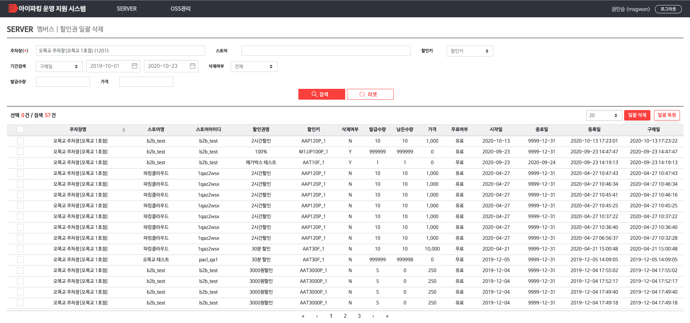

# 할인권 일괄 삭제 가이드
스토어 할인권을 **일괄 삭제/복원** 처리할 수 있는 기능

- 검색조건
    - 주차장, 스토어, 할인키, 기간검색, 삭제여부, 발급수량, 가격
- 일괄 삭제/복원
    - 좌측 체크박스를 선택하고 **일괄 삭제/복원** 버튼을 클릭해 **삭제/복원** 처리를 진행

---

## 1) 일괄 삭제
1. 삭제할 스토어 할인권을 선택
2. **일괄 삭제** 버튼을 클릭
3. **변경사유**를 입력하고 **적용** 버튼을 클릭

**※일괄 삭제 버튼클릭시 삭제여부가 Y인 건은 자동으로 선택해제 됨**

---

## 2) 일괄 복원
1. 복원할 스토어 할인권을 선택
2. **일괄 복원** 버튼을 클릭
3. **변경사유**를 입력하고 **적용** 버튼을 클릭

**※일괄 복원 버튼클릭시 삭제여부가 N인 건은 자동으로 선택해제 됨**

