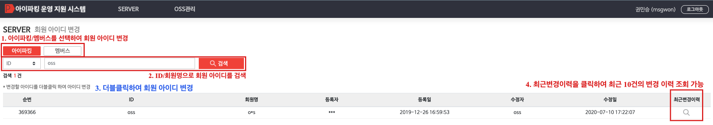
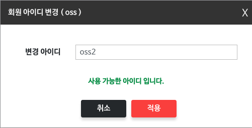
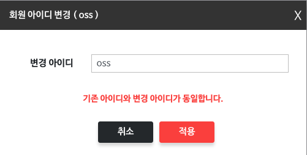

# 회원 아이디 변경 가이드
**아이파킹**, **멤버스** 아이디를 변경할 수 있는 기능

---

## 1) 회원 아이디 변경

### 사용 가능한 아이디 확인
변경할 아이디를 입력하면 하단에 **사용 가능한 아이디** 여부를 확인할 수 있다
**사용 가능한 아이디** 인 경우 **적용이 가능** 하다

### 기존 아이디와 변경 아이디가 동일한지 확인
변경할 아이디를 입력하면 하단에 **기존 아이디와 변경 아이디가 동일한** 지 여부를 확인할 수 있다
**기존 아이디와 변경 아이디가 동일한**  경우 **적용이 불가능** 하다

---

## 2) 회원 아이디 변경 이력
조회된 회원 아이디의 우측 **최근변경이력 돋보기 버튼**을 클릭하면
**최근 10건의 회원 아이디 변경 이력**을 확인할 수 있다

