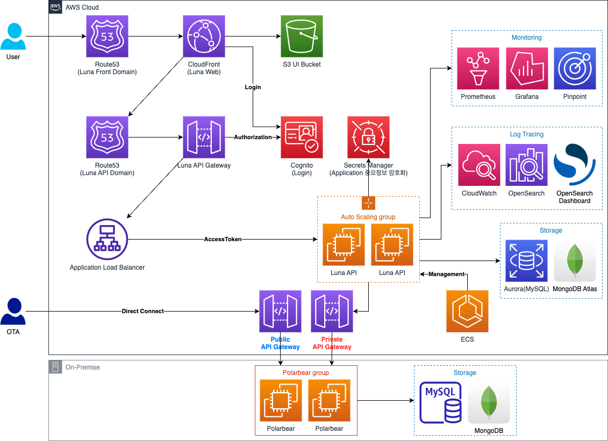
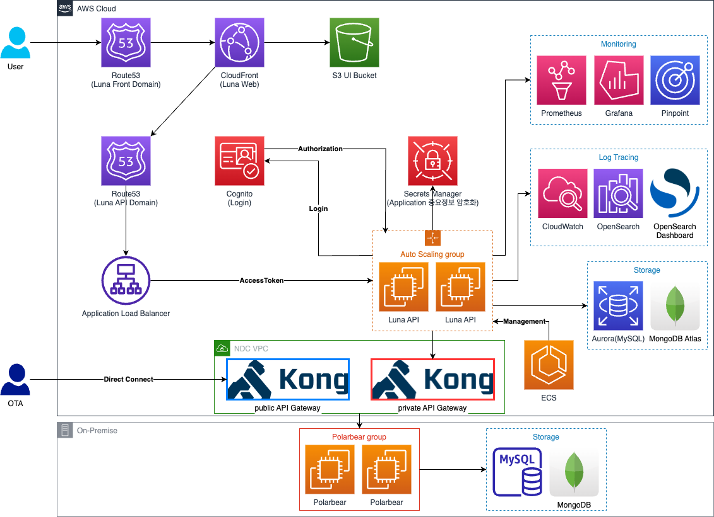
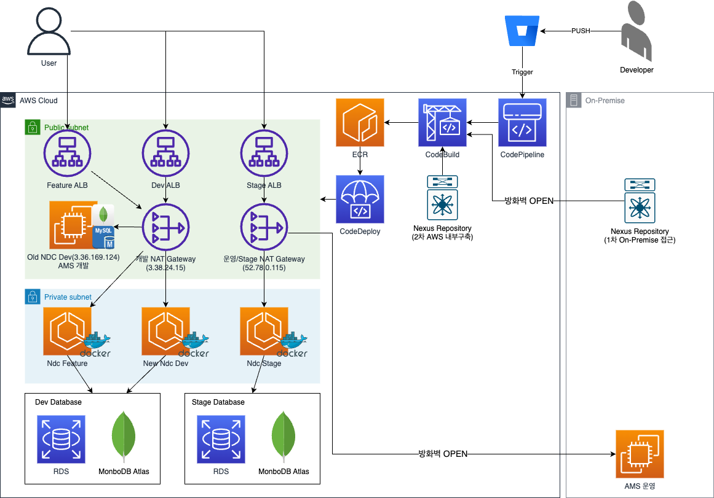

# 아키텍처 설계

<!-- TOC -->
* [아키텍처 설계](#아키텍처-설계)
  * [NDC Halo 프로젝트 AWS 아키텍처 설계](#ndc-halo-프로젝트-aws-아키텍처-설계)
  * [NDC Halo 프로젝트 AWS(Kong) 아키텍처 설계](#ndc-halo-프로젝트-awskong-아키텍처-설계)
  * [NDC Aggregator Stage AWS 환경 아키텍처 설계](#ndc-aggregator-stage-aws-환경-아키텍처-설계)
  * [추천 서비스 API(오마카세) 아키텍처 설계](#추천-서비스-api오마카세-아키텍처-설계)
<!-- TOC -->

---

## NDC Halo 프로젝트 AWS 아키텍처 설계

---

## NDC Halo 프로젝트 AWS(Kong) 아키텍처 설계

---

## NDC Aggregator Stage AWS 환경 아키텍처 설계

---

## 추천 서비스 API(오마카세) 아키텍처 설계

-architecture.png)

---