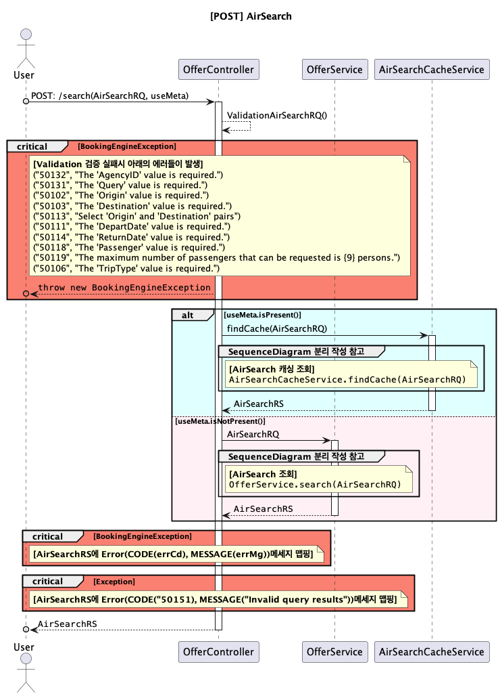

# AirSearch SequenceDiagram

<!-- TOC -->
* [AirSearch SequenceDiagram](#airsearch-sequencediagram)
  * [Plantuml 코드 참고](#plantuml-코드-참고)
* [1. [POST] AirSearch](#1-post-airsearch)
  * [1-1. AirSearch 캐싱 조회 서비스](#1-1-airsearch-캐싱-조회-서비스)
  * [1-2. AirSearch 조회 서비스](#1-2-airsearch-조회-서비스)
  * [분리 작성 Sequence Diagram](#분리-작성-sequence-diagram)
  * [항공사(Airline) NDC버전별 AirSearchRS 변환](#항공사airline-ndc버전별-airsearchrs-변환)
  * [프로모션 적용](#프로모션-적용)
  * [항공사(Airline) Map 정보 조회](#항공사airline-map-정보-조회)
    * [AgencyProviderProfile 단건 조회](#agencyproviderprofile-단건-조회)
    * [AgencyProviderProfile List 조회](#agencyproviderprofile-list-조회)
  * [Shopping 프로모션 정보 초기화](#shopping-프로모션-정보-초기화)
  * [Shopping Pay 프로모션 정보 초기화](#shopping-pay-프로모션-정보-초기화)
  * [Shopping 프로모션 적용](#shopping-프로모션-적용)
  * [Shopping Pay 프로모션 적용](#shopping-pay-프로모션-적용)
  * [Shopping 커미션 적용](#shopping-커미션-적용)
  * [(Async) 항공사(Airline) AirShopping 요청/응답](#async-항공사airline-airshopping-요청응답)
    * [항공사(Airline) AirShopping 요청/응답](#항공사airline-airshopping-요청응답)
    * [사이트별 노출 구간 제어를 위한 조회(RouteInfo)](#사이트별-노출-구간-제어를-위한-조회routeinfo)
    * [(Async) 항공사(Airline) NDC 요청/응답](#async-항공사airline-ndc-요청응답)
    * [Agency 일일 요청 수 조회](#agency-일일-요청-수-조회)
    * [항공사(Airline) Transaction Credential 조회](#항공사airline-transaction-credential-조회)
    * [JaxbContext Marshall](#jaxbcontext-marshall)
    * [JaxbContext UnMarshall](#jaxbcontext-unmarshall)
<!-- TOC -->

---

## Plantuml 코드 참고
```
participant OfferService as offer
database MongoDB as mongo
box #Lavender
    participant AMS
end box
<i>[[http://amsapi.tourvis.com]]</i>
note right of airlineTransaction: **<size:18>MockService 개발 대상!!</size>**
note right of airlineTransaction #SpringGreen: **<size:18>기능 분리가 필요!!</size>**
alt #LightCyan useMeta.isPresent()
else #LavenderBlush useMeta.isNotPresent()
group #DarkTurquoise AirShoppingRQ 변환
group #DarkTurquoise AirShoppingRS 변환
group #SandyBrown AirShoppingService 구현체 셋팅
group #STRATEGY NDC RQ로그 파일생성
group #BurlyWood LogService(LogParam 셋팅)
loop #Violet AgencyProviderProfile : List<AgencyProviderProfile>
critical #Salmon BookingEngineException
group #DodgerBlue NDC 요청/응답
group #YellowGreen 변환된 AirSearchRS 병합 처리
group #GreenYellow MongoDB Cache 데이터 조회
group #Gainsboro Dependency Cycle
group #Aqua MySQL Select List<AgencyProviderProfile>
group #MediumAquaMarine Route 정보 조회
group #Thistle MailSmsService
group #Thistle SlackNotificationService
group #IMPLEMENTATION NDC 메세지 유효성 검증
```

# 1. [POST] AirSearch

`OfferController.search(@Valid @RequestBody AirSearchRQ airSearchRQ, @PathVariable Optional<String> useMeta)`

[▶︎ PlantUML CODE](plantuml/1.AirSearch.puml)



---

## 1-1. AirSearch 캐싱 조회 서비스

`OfferController.search(AirSearchRQ airSearchRQ) -> AirSearchCacheService.findCache((AirSearchRQ airSearchRQ)`

[▶︎ PlantUML CODE](plantuml/1-1.AirSearch%20%EC%BA%90%EC%8B%B1%20%EC%A1%B0%ED%9A%8C%20%EC%84%9C%EB%B9%84%EC%8A%A4.puml)


---


## 1-2. AirSearch 조회 서비스

`OfferController.search(AirSearchRQ airSearchRQ) -> OfferService.search(AirSearchRQ airSearchRQ, boolean usePromotion)`

[▶︎ PlantUML CODE](plantuml/1-2.AirSearch%20%EC%A1%B0%ED%9A%8C%20%EC%84%9C%EB%B9%84%EC%8A%A4.puml)


---

## 분리 작성 Sequence Diagram


## 항공사(Airline) NDC버전별 AirSearchRS 변환

`OfferService.search(AirSearchRQ airSearchRQ, boolean usePromotion) -> ConvertShoppingService.convertRS(Object responseData, AirportMapInfo airportMapInfo)`

[▶︎ PlantUML CODE](plantuml/sub/%ED%95%AD%EA%B3%B5%EC%82%AC(Airline)%20NDC%EB%B2%84%EC%A0%84%EB%B3%84%20AirSearchRS%20%EB%B3%80%ED%99%98.puml)

%20NDC버전별%20AirSearchRS%20변환.png)

---

## 프로모션 적용

`AirSearchCacheService.findCache((AirSearchRQ airSearchRQ) -> AirSearchCacheService.applyPromotion(AirSearchRQ, AirSearchRS)`

[▶︎ PlantUML CODE](plantuml/sub/Shopping%20%ED%94%84%EB%A1%9C%EB%AA%A8%EC%85%98%20%EC%A0%81%EC%9A%A9.puml)


---

## 항공사(Airline) Map 정보 조회

- `OfferService.search(AirSearchRQ) -> AirportMapService.getAirportMapInfo(String)`
- `AirSearchCacheService.applyPromotion(AirSearchRQ, AirSearchRS) -> AirportMapService.getAirportMapInfo(String)`

[▶︎ PlantUML CODE](plantuml/sub/%ED%95%AD%EA%B3%B5%EC%82%AC(Airline)%20Map%20%EC%A0%95%EB%B3%B4%20%EC%A1%B0%ED%9A%8C.puml)


---

### AgencyProviderProfile 단건 조회

`OfferService.search(AirSearchRQ airSearchRQ, boolean usePromotion) -> AgencyProviderConfig.getAgencyProvider(String agencyId, String serviceCode, String airlineId)`

[▶︎ PlantUML CODE](plantuml/sub/AgencyProviderProfile%20%EB%8B%A8%EA%B1%B4%20%EC%A1%B0%ED%9A%8C.puml)


---

### AgencyProviderProfile List 조회

- `OfferService.search(AirSearchRQ airSearchRQ, boolean usePromotion) -> AgencyProviderConfig.getAgencyProvider(String agencyId, String serviceCode)`
- `AirSearchCacheService.applyPromotion(AirSearchRQ, AirSearchRS) -> AgencyProviderConfig.getAgencyProvider(String agencyId, String serviceCode)`

[▶︎ PlantUML CODE](plantuml/sub/AgencyProviderProfile%20List%20%EC%A1%B0%ED%9A%8C.puml)


---

## Shopping 프로모션 정보 초기화

`OfferService.search(AirSearchRQ airSearchRQ, boolean usePromotion) -> ShoppingPromotionService.initShoppingPromotionInfo(Object objAirshoppingRQ, String siteCd)`

`AirSearchCacheService.applyPromotion(AirSearchRQ, AirSearchRS) -> ShoppingPromotionService.initShoppingPromotionInfo(Object objAirshoppingRQ, String siteCd)` 

[▶︎ PlantUML CODE](plantuml/sub/Shopping%20%ED%94%84%EB%A1%9C%EB%AA%A8%EC%85%98%20%EC%A0%95%EB%B3%B4%20%EC%B4%88%EA%B8%B0%ED%99%94.puml)


---

## Shopping Pay 프로모션 정보 초기화

`ShoppingFopPromotionServiceImpl.initShoppingFopPromotionInfo(Object objAirshoppingRQ, String agencyId, String siteCd)`

[▶︎ PlantUML CODE](plantuml/sub/Shopping%20Pay%20%ED%94%84%EB%A1%9C%EB%AA%A8%EC%85%98%20%EC%A0%95%EB%B3%B4%20%EC%B4%88%EA%B8%B0%ED%99%94.pumlk)


---

## Shopping 프로모션 적용

`OfferService.search(AirSearchRQ airSearchRQ, boolean usePromotion) -> ShoppingPromotionService.applyPromotionAirSearchRS(String responseID, AirSearchRS.DATA data, String tripType, ShoppingConsoleInfo shoppingConsoleInfo)`

`AirSearchCacheService.applyPromotion(AirSearchRQ, AirSearchRS) -> ShoppingPromotionService.applyPromotionAirSearchRS(String responseID, AirSearchRS.DATA data, String tripType, ShoppingConsoleInfo shoppingConsoleInfo)`

[▶︎ PlantUML CODE](plantuml/sub/Shopping%20Pay%20%ED%94%84%EB%A1%9C%EB%AA%A8%EC%85%98%20%EC%A0%81%EC%9A%A9.puml)


---

## Shopping Pay 프로모션 적용

`OfferService.search(AirSearchRQ airSearchRQ, boolean usePromotion) -> ShoppingFopPromotionService.applyPromotionAirSearchRS(AirSearchRQ airSearchRQ, String responseID, AirSearchRS.DATA data, String tripType, PayPromotionInfo payPromotionInfo)`

`AirSearchCacheService.applyPromotion(AirSearchRQ, AirSearchRS) -> ShoppingFopPromotionService.applyPromotionAirSearchRS(AirSearchRQ airSearchRQ, String responseID, AirSearchRS.DATA data, String tripType, PayPromotionInfo payPromotionInfo)`

[▶︎ PlantUML CODE](plantuml/sub/Shopping%20Pay%20%ED%94%84%EB%A1%9C%EB%AA%A8%EC%85%98%20%EC%A0%81%EC%9A%A9.puml)


---

## Shopping 커미션 적용

`OfferService.search(AirSearchRQ airSearchRQ, boolean usePromotion) -> ShoppingCommissionService.applyCommissionAirSearchRS(String responseID, AirSearchRS.DATA data, AirSearchRQ airSearchRQ, ShoppingConsoleInfo shoppingConsoleInfo, AirportMapInfo airportMapInfo)`

`AirSearchCacheService.applyPromotion(AirSearchRQ, AirSearchRS) -> ShoppingCommissionService.applyCommissionAirSearchRS(String responseID, AirSearchRS.DATA data, AirSearchRQ airSearchRQ, ShoppingConsoleInfo shoppingConsoleInfo, AirportMapInfo airportMapInfo)`

[▶︎ PlantUML CODE](plantuml/sub/Shopping%20%EC%BB%A4%EB%AF%B8%EC%85%98%20%EC%A0%81%EC%9A%A9.puml)


---

## (Async) 항공사(Airline) AirShopping 요청/응답

`OfferService.search(AirSearchRQ airSearchRQ, boolean usePromotion) -> AsyncAirShoppingService.request(AirShoppingService airShoppingService, Object objAirShoppingRQ)`

[▶︎ PlantUML CODE](plantuml/sub/(Async)%20%ED%95%AD%EA%B3%B5%EC%82%AC(Airline)%20AirShopping%20%EC%9A%94%EC%B2%AD%EC%9D%91%EB%8B%B5.puml)

%20항공사(Airline)%20AirShopping%20요청응답.png)

---

### 항공사(Airline) AirShopping 요청/응답

`OfferService.search(AirSearchRQ airSearchRQ, boolean usePromotion) -> AirShoppingService.airShopping(Object requestRQ)`

[▶︎ PlantUML CODE](plantuml/sub/%ED%95%AD%EA%B3%B5%EC%82%AC(Airline)%20AirShopping%20%EC%9A%94%EC%B2%AD%EC%9D%91%EB%8B%B5.puml)

%20AirShopping%20요청응답.png)

---

### 사이트별 노출 구간 제어를 위한 조회(RouteInfo)

`AirShoppingService.airShopping(Object requestRQ) -> RouteInfoDataProvider.getRouteInfo(Object objAirShoppingRQ, String agencyId, String siteCd)`

[▶︎ PlantUML CODE](plantuml/sub/%EC%82%AC%EC%9D%B4%ED%8A%B8%EB%B3%84%20%EB%85%B8%EC%B6%9C%20%EA%B5%AC%EA%B0%84%20%EC%A0%9C%EC%96%B4%EB%A5%BC%20%EC%9C%84%ED%95%9C%20%EC%A1%B0%ED%9A%8C(RouteInfo).puml)

.png)

---

### (Async) 항공사(Airline) NDC 요청/응답

`AirShoppingService.airShopping(Object requestRQ) -> NdcClient.requestAsync(T request, AgencyProvider agencyProvider)`

[▶︎ PlantUML CODE](plantuml/sub/(Async)%20%ED%95%AD%EA%B3%B5%EC%82%AC(Airline)%20NDC%20%EC%9A%94%EC%B2%AD%EC%9D%91%EB%8B%B5.puml)

%20항공사(Airline)%20NDC%20요청응답.png)

---

### Agency 일일 요청 수 조회

`NdcClient.requestAsync(T request, AgencyProvider agencyProvider) -> AgencyPerdayCallCountMapper.getPerdayCallCount(String agencyId, String providerCode, String twoCode)`

[▶︎ PlantUML CODE](plantuml/sub/Agency%20%EC%9D%BC%EC%9D%BC%20%EC%9A%94%EC%B2%AD%20%EC%88%98%20%EC%A1%B0%ED%9A%8C.puml)


---

### 항공사(Airline) Transaction Credential 조회

`NdcClient.requestAsync(T request, AgencyProvider agencyProvider) -> TransactionCredentialService.getCredential(TransactionParams transactionParams)`

[▶︎ PlantUML CODE](plantuml/sub/%ED%95%AD%EA%B3%B5%EC%82%AC(Airline)%20Transaction%20Credential%20%EC%A1%B0%ED%9A%8C.puml)

%20Transaction%20Credential%20조회.png)

---

### JaxbContext Marshall

- `NdcClient.requestAsync(T request, AgencyProvider agencyProvider)` -> `NDCMarshallUnMarshallService.marshall(T request, String version, String providerCode, String serviceCode)`

[▶︎ PlantUML CODE](plantuml/sub/JaxbContext%20Marshall.puml)


---

### JaxbContext UnMarshall

`NdcClient.requestAsync(T request, AgencyProvider agencyProvider)` -> `NDCMarshallUnMarshallService.unmarshall(String response, String version, String providerCode, String serviceCode)`

[▶︎ PlantUML CODE](plantuml/sub/JaxbContext%20UnMarshall.puml)


---